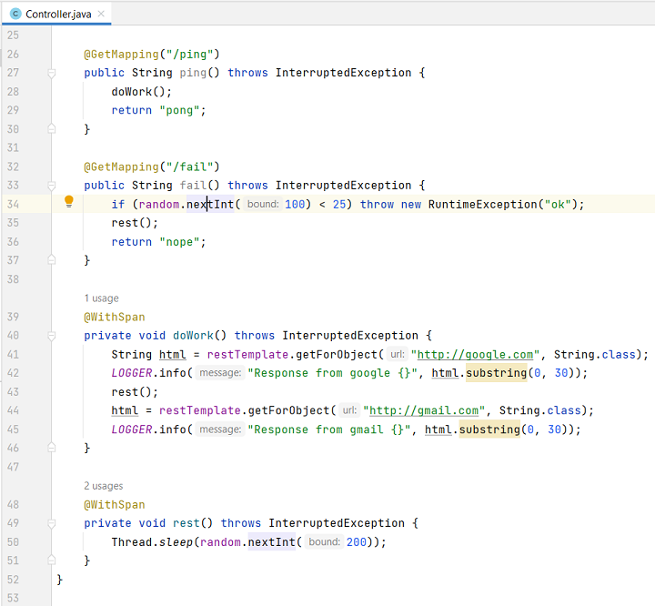
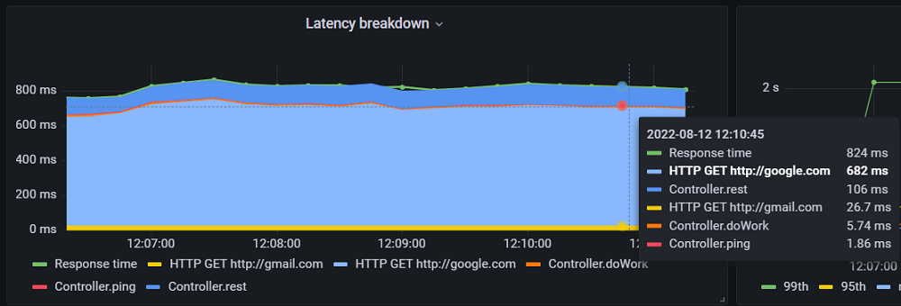

# Lightweight APM

This a proof of concept of a typical for many APMs transaction breakdown chart.
It shows transaction (say REST HTTP endpoint) response time and time spent in various pieces of code and external calls.

For example, for the following Spring controller with OpenTelemetry annotations:


It shows the following chart:


The PoC is based on the [OpenTelemetry Java Agent](https://opentelemetry.io/docs/instrumentation/java/automatic) and a custom extension that converts spans to metrics

The demo part relies on:  
- The agent's Prometheus metrics exporter
- Prometheus
- Grafana

Prometheus/Grafana can be replaced with a compatible could provider service. Or it can be used together with solutions like https://opstrace.com. 

Two main benefits:
- it does not require trace storage/querying solution (like Jaeger or Tempo)
- it gives you aggregated overview of the traces which is not available in many tracing solutions

In addition to the useful metrics, you are getting log correlation id (log tracing) out of the box. 

It is not production ready as there are a lot of TODOs, say
- handling of parallel sub spans
- span naming for various types of external calls (HTTP, databases, etc)
- support of message consuming services
- ...

But if you are not keen to host full-fledged tracing solution or use one as a service, it may be worth trying (amd finishing up) this PoC. 

Video recording of the PoC dashboards:

https://user-images.githubusercontent.com/25208879/184332263-7993e019-2315-4092-bd1e-c624a19eff8d.mp4

## Prerequisites

* Java 11
* Docker compose

# How to run

Build the components

```shell
./gradlew build
```

Run the components

```shell
docker-compose --project-directory compose up
```

In a browser 
- open http://localhost:3000/d/NjUyqzM5Z/top-transactions
- click on one of transactions to drill down and see more details
